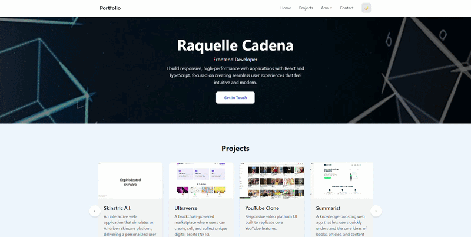
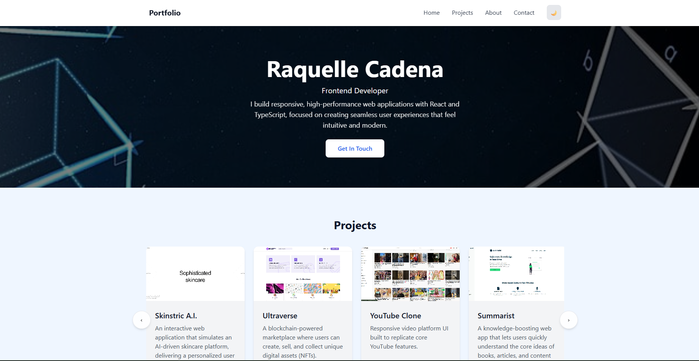

# 🚀 Portfolio 

### A modern frontend portfolio showcasing production-grade UI engineering

---

## ⚡ Built for Performance. Designed for Experience.

Portfolio OS is a frontend developer portfolio built to simulate a real SaaS product experience.  
It focuses on clean UI, smooth interactions, and scalable React architecture.

---

## ✨ Key Features

- Interactive project carousel with smooth horizontal navigation  
- Dark mode with persistent user preference  
- Fully responsive layout (mobile → desktop optimized)  
- Animated UI transitions for modern feel  
- EmailJS contact integration  
- Performance-focused Next.js architecture  

---

## 🧠 Tech Stack

- **Frontend:** React, Next.js  
- **Styling:** Tailwind CSS  
- **Language:** TypeScript  
- **Tools:** EmailJS, Vercel  

---

## 📦 Live Experience

👉 **Live Site:**  
https://portfolio-eight-omega-85.vercel.app/practice/module-5-portfolio  

---

## 🧩 Featured Work

### 🧴 Skinstric A.I.
AI-powered skincare simulation experience with dynamic UI personalization.

### 🌐 Ultraverse
NFT-style digital marketplace concept with blockchain-inspired UX.

### 🎥 YouTube Clone
Fully responsive video platform UI replicating core YouTube functionality.

### 📚 Summarist
Content summarization app designed for fast knowledge consumption.

### 🍿 Netflix Clone
Streaming-style interface with modern responsive layout system.

---

## 📸 Product Preview

---

## 🧭 Architecture Highlights

- Component-based UI structure (React)
- Server-side rendering with Next.js
- Reusable design system using Tailwind CSS
- Optimized image handling with Next.js Image component
- State-driven UI interactions

---

## 🚀 Performance First

This project prioritizes:

- Fast load times  
- Smooth scrolling interactions  
- Minimal layout shift  
- Mobile-first responsiveness  

---

## 📬 Contact

Let’s connect:

- LinkedIn: https://www.linkedin.com/in/raquelle-cadena-7493013a7/  
- GitHub: https://github.com/raquelledianne  

---
